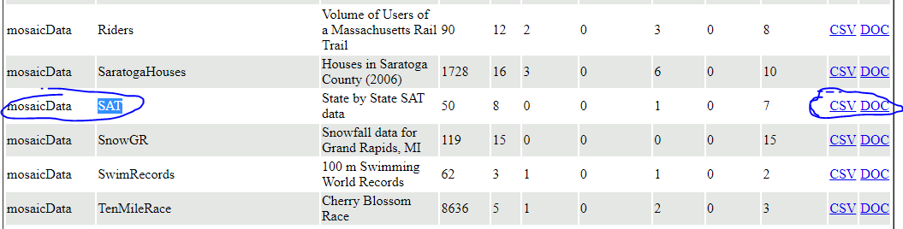
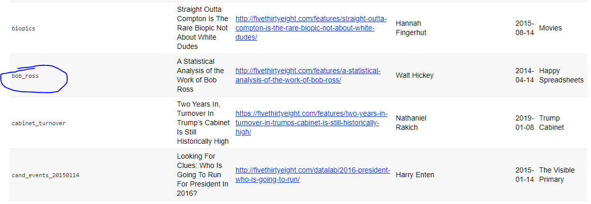

```{r setup, include=FALSE}
knitr::opts_chunk$set(echo = TRUE)

library(openintro)
library(tidyverse)
```

There are several possible sources for finding data:

# Option 1: Data Sets Used in the Textbook
The website for our textbook offers the option take a look at any of the data
sets mentioned in the textbook.  These are included the the package `openintro`
that is used in each of our lab reports.

**Type** (don’t copy!) this text into the console:

```{r eval=FALSE}
openintro::
```

If halfway through typing the autocomplete suggests “openintro::” it’s okay to press tab.  A dropdown menu should pop up, and if you highlight elements of the menu a yellow description should pop up to the right of the menu.  Things on the menu next to a tilted rectangle icon are functions, and are probably useless to you for this project.  Things on the menu next to a spreadsheet icon are data sets.


For your project, you want a real data set, so ignore any data set that includes the word “simulation” in its description.  An example is the data set of several people’s ages when they got married:
```{r eval=FALSE}
openintro::age_at_mar
```


Once you've picked the data set you like, run `data(the-name-of-the-data-set)`

```{r}
data(age_at_mar)
```

Using a trick we learned in Lab 1, you can find the description of this data set by putting a “?” in front:

```{r eval=FALSE}
?openintro::age_at_mar
```

A very important element of the description is the source website.  You’ll need to check this out before the final write up of your project.  By running the code above, I can see that the source is the National Survey of Family Growth, 2006-2010 cycle, http://www.cdc.gov/nchs/nsfg/nsfg_2006_2010_puf.htm.

# Option 2: Data from public R repositories

Follow the link below to a table of several data sets.
https://vincentarelbundock.github.io/Rdatasets/datasets.html
To view any of these data sets in R, the first column is the name of the R-package and the second column is the name of the dataset.  For example, if I wanted to do my project on State-by-State SAT data I would go to the middle of the table:



First, I need to install the package (remember, only do this once in your console)
```{r eval=FALSE}
install.packages("mosaicData")
```

Then load the library
```{r}
library(mosaicData)
data(SAT)
```

Most of these data sets show you the source of the data if you view their help file
```{r eval=FALSE}
?SAT
```

You don't have to do your data analysis in R.  If you choose to use a different software, then make sure to document everything you do so that your work is reproducible.  You can go to the website linked above and download the data as a CSV file that you should be able to open with any statistical software.

# Option 3: Data from FiveThirtyEight.com

The website FiveThirtyEight.com has data from several articles they’ve written.  The easiest way to get their data in R is to use one of two packages that three data scientists created.

The first package contains most of the data sets
```{r eval=FALSE}
install.packages("fivethirtyeight")
```
and the second package contains 19 big data sets
```{r eval=FALSE}
install.packages('fivethirtyeightdata', repos = 'https://fivethirtyeightdata.github.io/drat/', type = 'source')
```

You can see a list of all the datasets with links to the original articles [here](https://cran.r-project.org/web/packages/fivethirtyeight/vignettes/fivethirtyeight.html)

For example, if I want to look at some data for the article "A Statistical Analysis of the Work of Bob Ross"



I would run

```{r}
library(fivethirtyeight)
data(bob_ross)
```

# Extra Credit

You will be given two points extra credit point if the data relates to your major.  In order to get these points you have to explain in your final project how this data relates to your major.


# Outputing your data somewhere else:

There is no requirement to use R for this project.  If you’re more comfortable with another program, then you are welcome to use it.  However, **make sure everything you do is reproducible.**  Document everything you do so that someone else could easily redo your work.

If the name of your data is “MyData” then the following code will create a csv file.  Feel free to change the file name to whatever you like, as long as it ends in “.csv”.  You should be able to open a csv file with Microsoft Excel, Apple Numbers, Minitab, or SPSS:

```{r eval=FALSE}
write.csv(MyData, file = "ThisIsMyFileName.csv")
```

Your file now exists on your computer in your working directory.  If you don’t know where your working directory is try the code:

```{r eval=FALSE}
getwd()
```


The output this function gives you is the folder you need to look in for the file you just created.

